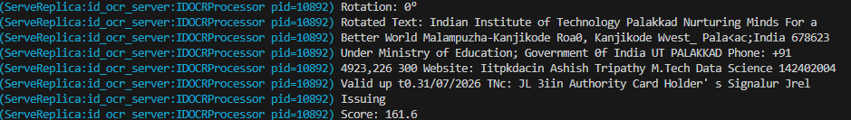
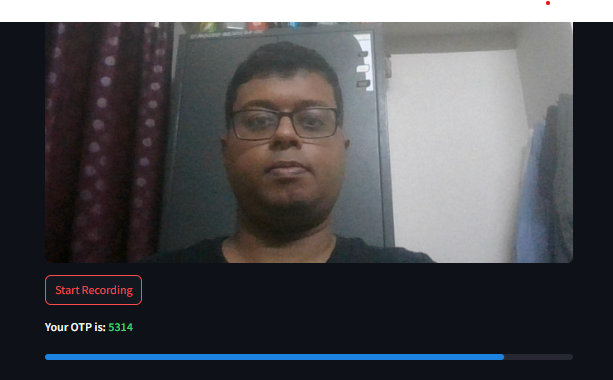

##### For detailed documentation please run `just documentation`

## Frontend

### Proposed Workflow

- **Registration Form(Registration is done in 3 steps)**
  - **Step 1**: Enter details -> Enter a valid document img -> Click on 'Next Button. At the backend profile picture extracted and compared with the live image. On success go to Page 2.
  - **Step 2**: Enter your personal details and review submitted information.
  - **Step 3**: Record a video for a generated OTP and verify whether the user has shown the correct sequence of IDs.
- **Login Form:** Enter credentials and record the video for the OTP. At the backend the video will be used for hand-sign detection, and snapshots from the recording will be used.

### Tech Stack

- `streamlit`
- `opencv-python`

### Tasks completed

- Creation of the registration page.
- Functionality to prevent duplicate registration
- Saving the document and live image + video into a folder.

### Tasks to be completed

- Backend Integration
- Integrate live video recording into the main UI

## OCR and Face Similarity

This module processes an ID card image, extracts text using Optical Character Recognition (OCR), and compares the ID card photo with a live webcam image to verify identity.

### Code Breakdown

1. **Tech Stack**

   - `opencv-python`: For image processing.
   - `easyocr`: For OCR text extraction.
   - `face_recognition`: For face comparison.
   - `pydantic`: For image path validation.

2. **OCR Processing**

   - Extracts text from the uploaded ID card image.
   - Converts images to grayscale for better OCR accuracy.
     

3. **Face Similarity Check**

   - Detects faces in both the ID card image and webcam snapshot.
   - Uses `model="cnn"` for face detection to improve accuracy.
   - Encodes and compares face embeddings to determine similarity.
   - Returns a confidence score for verification.

4. **Validation Process**
   - If face match confidence exceed a predefined threshold, the verification is successful.
   - Otherwise, the user is prompted to retry.

## Hand sign recognition

This script processes a recorded video (`output.mp4`) to detect hand gestures using MediaPipe Hands and counts the number of fingers shown. It saves the processed output as `output.mp4`. The sequence of detected numbers is validated against an OTP to verify the user.
<!--  -->

### Code Breakdown

1. **Tech Stack**

   - `cv2`: For video processing.
   - `mediapipe as mp`: For hand tracking.

2. **OTP Validation Function (`is_valid_pas`)**

   - Will be used for validating/verfiying password.

3. **Video Capture**

   - Loads the input video.
   - Captures video properties (width, height, FPS).
   - Initializes a video writer to save the output as `live_recording.mp4`.

4. **Define Finger Landmarks for Counting**

   - Thumb, Index, Middle, Ring, and Little fingers are tracked.

5. **Display and Save Processed Frames**

   - Annotates frames with the detected finger count.
   - Saves each processed frame to `live_recording.mp4`.
   - Displays the video in a window.

6. **Exit Conditions**

   - Stops when the video ends or 'q' is pressed.

7. **Validate OTP**
   - The generated sequence is checked against the expected OTP.
   - If matched, the user is verified; otherwise, verification fails.
