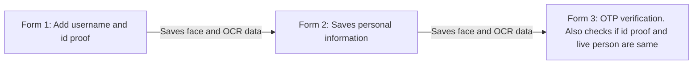
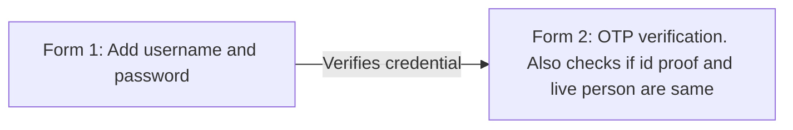
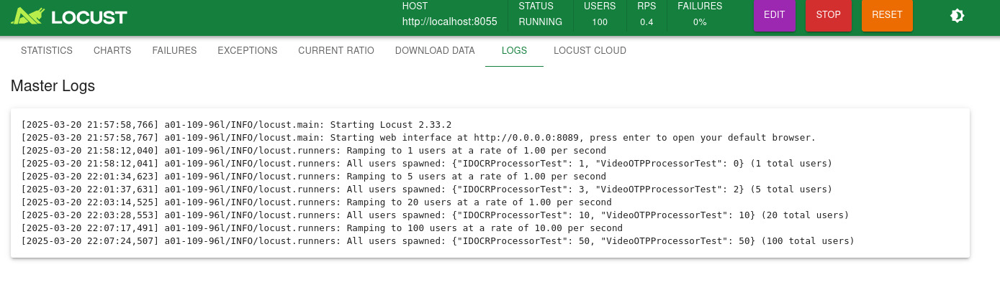
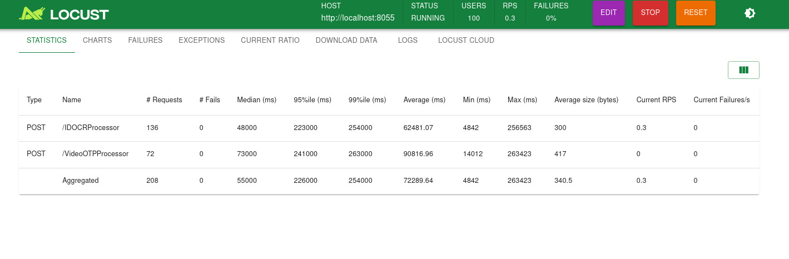
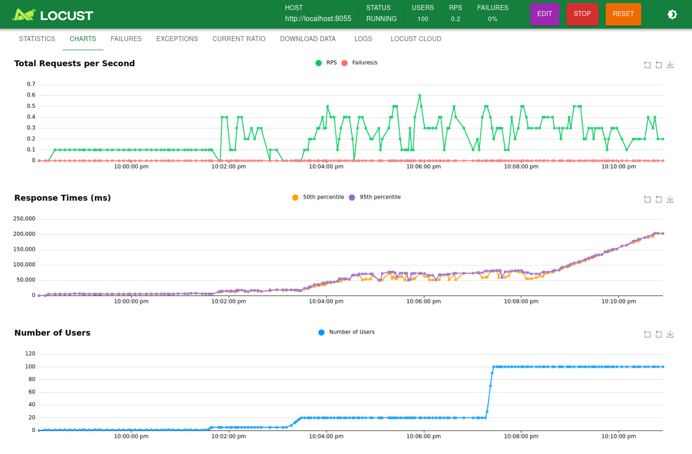

# __Functionality and Usage__

## __Application Features__

- __Frontend__: Takes an ID card image file during onboarding and records a video where the user shows hand signs to validate an OTP sent asynchronously by the backend via Streamlit. The system processes images and videos using async POST/GET functions, extracting and verifying OTPs through AI models. The UI dynamically updates based on user interactions, providing real-time validation feedback and interactive insights into the verification process.
- __Registration Pipeline__: 

- __Login Pipeline__: 

- __OCR__: EasyOCR library is used to extract text from the ID card image. Since the uploaded image can be sometimes tilted or rotated , the best angle for image is been selected where the textual data is more logical. The metrics to validate a textual data being more reasonable and normal is based on certain parameters and scores given. Such as reducing scores for special characters , combination of multiple uppercase and multiple lowercase letters in a single word and bigger the word size more it`s chances of correct readability from image.
- __Face Comparison__: To Compare a pair of face images, structural_similarity from skimage.metrics is being used.
- __Face Extraction From ID/Video__: CascadeClassifier module with haarcascade_frontalface dataset is used to extract face from the images / videos .
- __Backend__: FastAPI enables synchronous image / video uploads . The frontend sends a POST request with an image or video file path, which the backend saves locally and returns a separate POST request processes the file using OpenCV (cv2), extracting images and video frames containing hand signs that display OTP numbers for visual validation along with face validation captured through the video frames and facial image present on the ID card which had been saved while onboarding the customer. Ray Serve facilitates asynchronous calls to initialize and manage AI modules, acting as a middleware for efficient processing and scaling.
- __Locust Testing__: 


Testing with gradual amping of number users from 1-100


Statistics for load testing at 100 users


Chart statistics across RPM, response time and user count for load testing from 1 to 100 users

## __Pre Requisites__

- Linux OS(>= 22.04)
- Python(=3.12) 
- just (use ```sudo apt install just``` incase not installed)

## __Running the Application__

1. Clone the repository:
```git clone https://github.com/ashish142402004/Call_Analysis_SRProject.git```
2. Inside the main directory run the following commands:
    - For initial setup ```just setup```
    - To start and view the unified logger system ```just run_logger```
    - To start the frontend and backend use ```just run```
    - The frontend runs on ```http://localhost:8501```
    - __Note:__ Please check if the backend is running before testing. Wait for a message like ```Server started at http://0.0.0.0:8000```


## Known Issues:
- additional mkdocs or logging server running in the background: use `lsof -i :<port_number>` tp identify the process_id. Use `kill -9 process_id` . mkdocs may cause backend failure as it runs on same port. Please ensure it is killed before starting the project.
- Due to a limitation of streamlit's navigation functionality, buttons like `Next` which is used for navigation need to be clicked twice to switch page. For example, in registration form step 1, after uploading the document click on next button once. After a success toast message reclick the button to go to the next page. Similar functionality for all the remaining buttons that involve page navigations.  
- Due to a limitation of streamlit, post logout login is causing a deadlock due to session state variables being used for navigations.
- During ruff checks there are only 3 failure 'SLF001', it is happening because we didnt have sudo access to download ocr models, hence we couldnot use alternatives


<div class="grid cards" markdown>
  - [__<- App Architecture__](architecture.md)
  - [__Learning Experience ->__](experience.md)
</div>